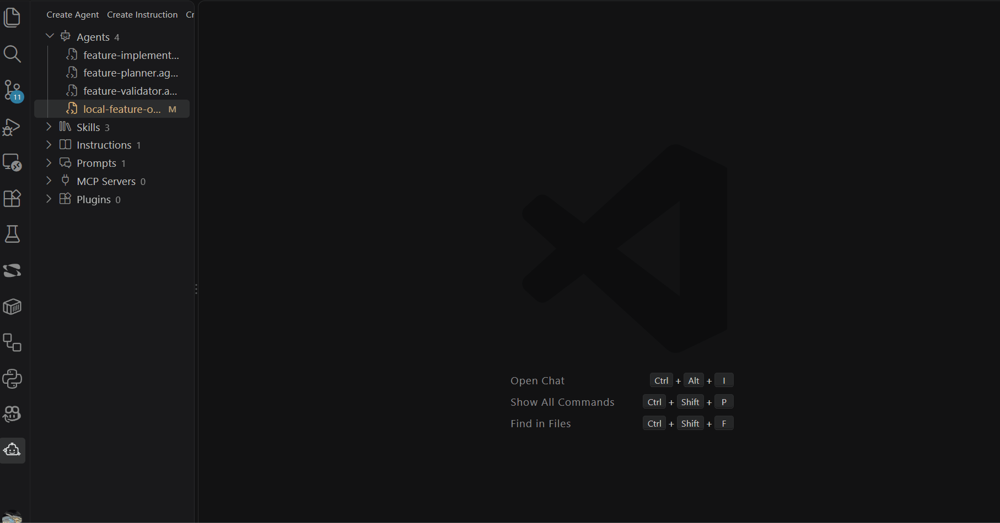

# 🤖 Copilot Assets Studio

Visually edit the YAML frontmatter of GitHub Copilot AI artifacts: agents, skills, instructions, and prompts.



## Features

This Visual Studio Code extension:

- discovers Copilot/Agent Customizations assets in the workspace (excluding `node_modules`)
- displays a **Copilot Assets** sidebar tree with Agents, Skills, Instructions, Prompts, MCP Servers, and Plugins; Agents, Skills, Instructions, and Prompts open in visual forms, while MCP Servers (`.vscode/mcp.json`) and Plugins (`plugin.json`) open as regular files
- lets you create and edit `*.agent.md` files through a visual form
- lets you create and edit `SKILL.md` files through a visual form
- lets you create and edit `*.instructions.md` files (`name`, `description`, `applyTo`) through a visual form
- lets you create and edit `*.prompt.md` files through a visual form; prompt files are deprecated and reusable prompts should migrate to agent skills
- shows collapsible, live validation and advice in the agent form (including YAML errors, unknown properties, tool/agent configuration rules, and GitHub cloud's 30,000-character instruction limit)
- supports three modes for agent `tools` and `agents`: selected values, all (`*`), and none (`[]`)
- shows separate approximate token counts for YAML frontmatter and Markdown, plus their total, in all editor forms; each section uses UTF-8 bytes / 4 (rounded up), not a model-specific bill or total conversation cost
- includes a Markdown preview of the body in the editors
- supports the officially documented properties for agent frontmatter
- preserves extra and unknown properties through an advanced YAML block, keeping parse/serialize round trips intact

The `model` field is edited through a selector. The default list can be customized
in VS Code settings with `copilotAssetsStudio.modelOptions`, for example:

```json
{
  "copilotAssetsStudio.modelOptions": [
    "GPT-5 (copilot)",
    "Claude Sonnet 4.5 (copilot)"
  ]
}
```

For local development, testing, and packaging instructions, see
[DEVELOPMENT.md](DEVELOPMENT.md).

## References

- Repository: https://github.com/marrubio/copilot-assets-studio
- VS Code extension documentation: https://code.visualstudio.com/api
- Publishing VS Code extensions: https://code.visualstudio.com/api/working-with-extensions/publishing-extension
- GitHub Copilot custom agents: https://docs.github.com/en/copilot/reference/custom-agents-configuration
- VS Code custom agents: https://code.visualstudio.com/docs/agent-customization/custom-agents
- GitHub Copilot agent skills: https://docs.github.com/en/copilot/concepts/agents/about-agent-skills
- VS Code prompt files: https://code.visualstudio.com/docs/agent-customization/prompt-files
